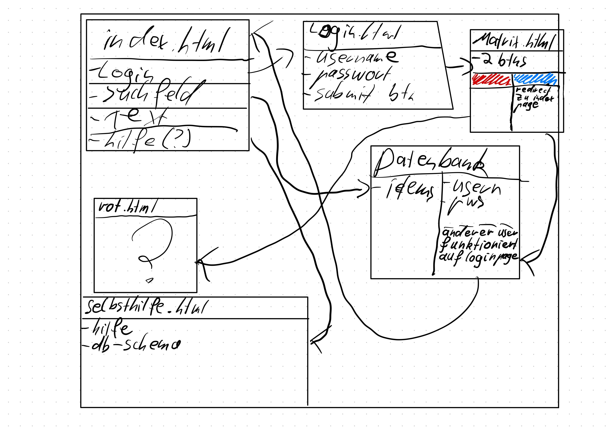

# Luca-Geburtstag
Geburtstag Karte für Luca

## Installation
* clone repo `git clone https://github.com/Fingadumbledore/Luca-Geburtstag.git`
* **You have to verify yourself with your Github login data**

### Automatic installation 
1. `bash setup.sh`
2. `cd /backend`
3. `bash db.sh`
### Manual installation

1. `bash setup.sh`
2. `cd /backend`
3. `docker-compose build`
4. `docker-compose up` additionally `-d` can be attached so that the container runs in the background

`docker-compose stop` to stop the db container
with `docker ps` you can see the currently running containers

to enter the container, just type `docker exec -it <container id> bash`

